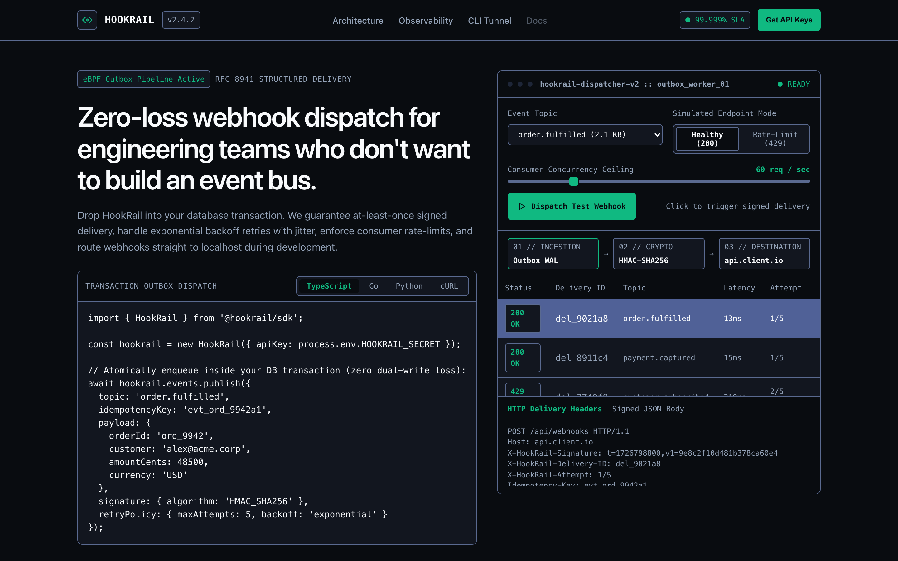
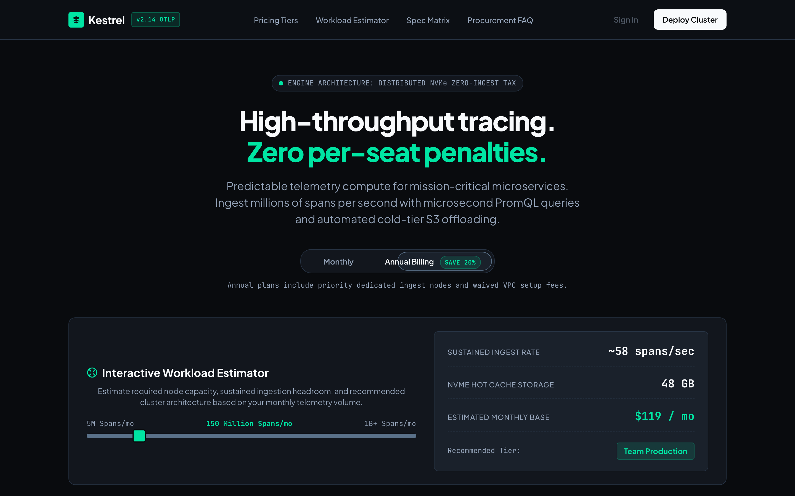
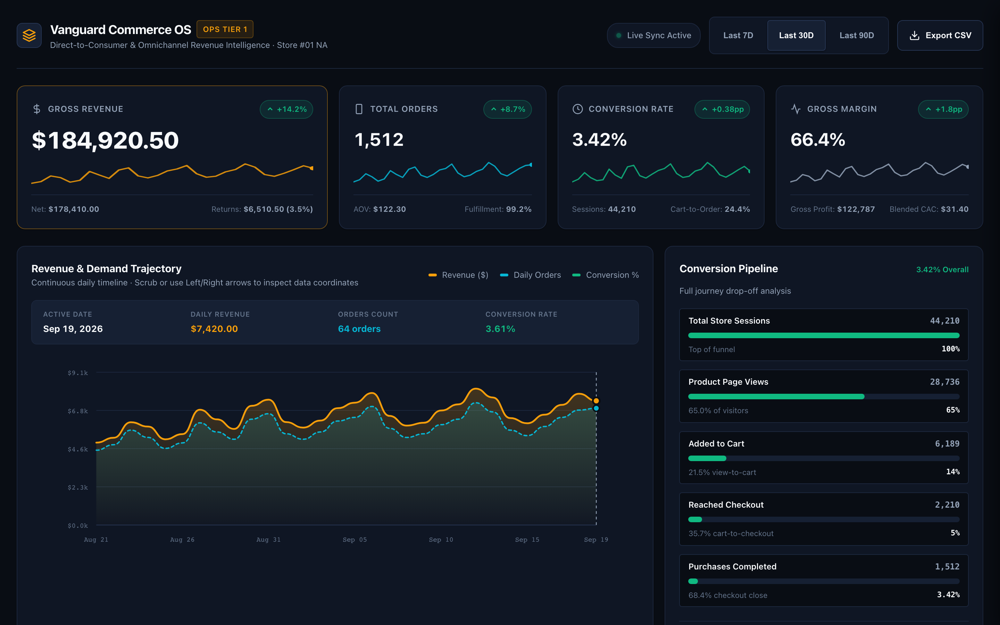
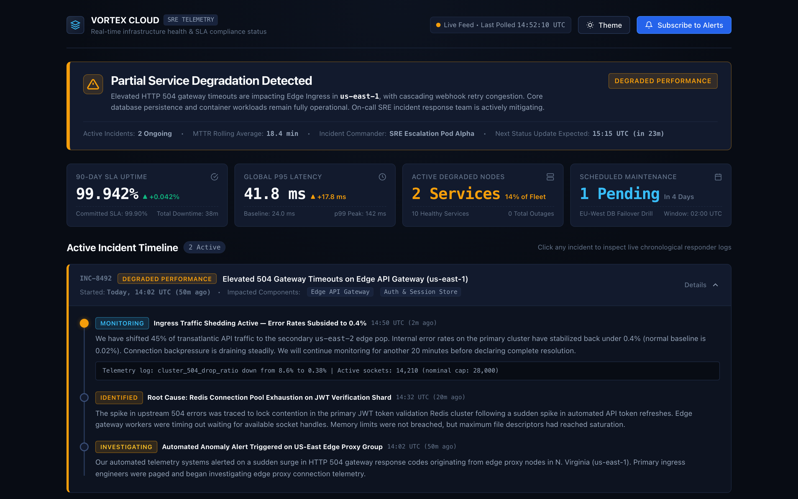
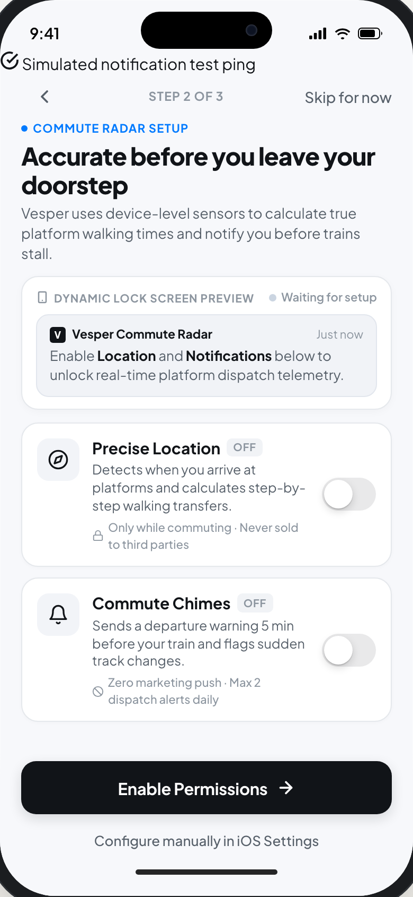
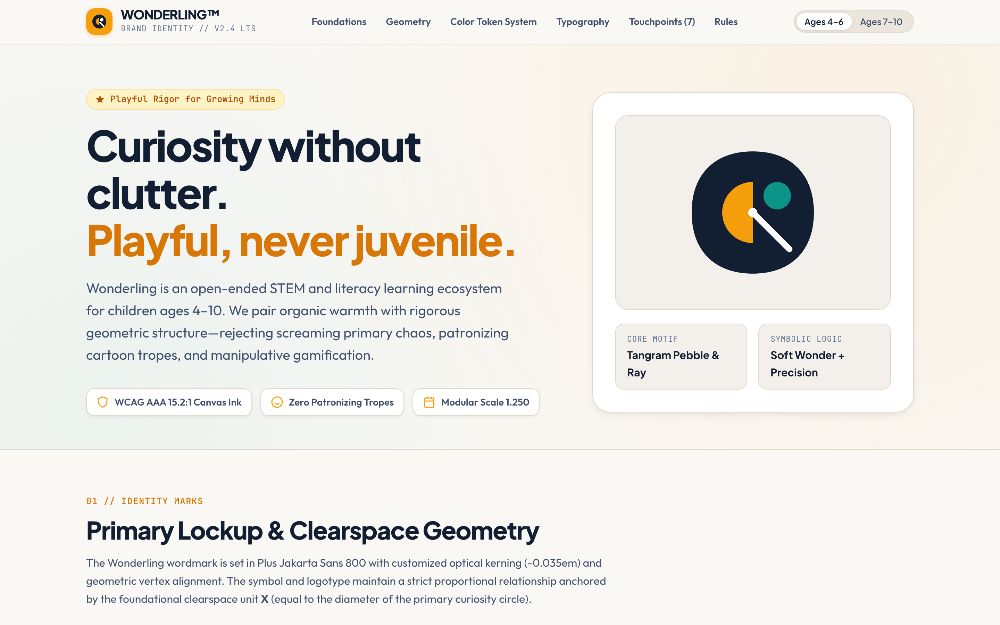
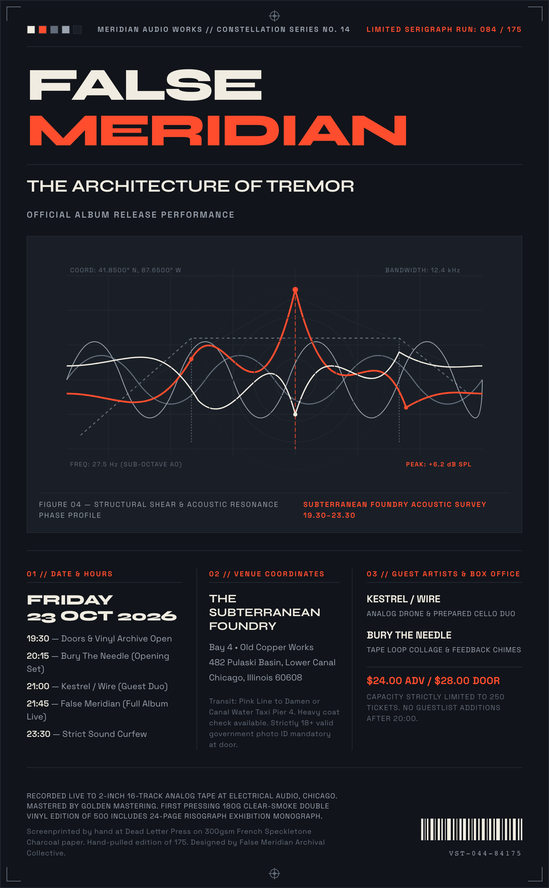
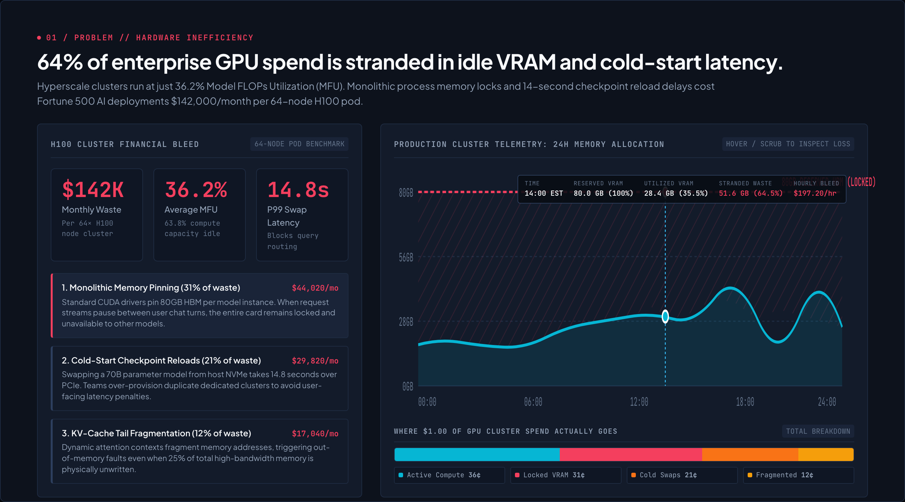

# Design Mastery

A Claude Code skill for producing genuinely considered design output — brand, UI,
motion, typography, illustration, and front-end craft — with zero AI-slop tells. It
loads a dense, researched ruleset (`SKILL.md`) plus a large reference library: an
anti-slop checklist, a category-specific pattern library, 86 real brand design-token
teardowns, an AI-generated-imagery guide, and Remotion guidance for programmatic video.

Install by dropping this repo's contents into `~/.claude/skills/design-mastery/`.

**Getting the repo:** on GitHub, use the green **Code** button → **Download ZIP** (no git
needed), or `git clone` the repo URL. Unzip/move it so its contents land directly inside
`~/.claude/skills/design-mastery/` (i.e. `SKILL.md` and `companion-skills/` should be
directly inside that folder, not nested one level deeper).

This repo bundles 39 full companion skill packs in `companion-skills/` — taste-skill,
image-to-code-skill, redesign-skill, frontend-design, canvas-design, theme-factory, and
more — not just links to them. Once installed, Claude reads them the same way it reads
`SKILL.md`; nothing else needs installing separately.

## What it's for

Point Claude at a screenshot, a URL, or a blank page and ask for a landing page,
product UI, dashboard, mobile screen, brand identity, poster, package, or deck — this
skill makes it check its own plan and output against a hard anti-slop checklist before
calling anything done, instead of defaulting to the generic gradient-hero,
three-icon-feature-grid, purple-and-black output every LLM converges on without it.

## Output samples

Rendered directly from the benchmark corpus in `benchmarks/outputs_v4_validation/`
via Playwright — real HTML/CSS built by this skill, not mockups.

### Web landing page

### Pricing page

### Dashboard (e-commerce)

### Dashboard (uptime monitoring)

### Mobile onboarding

### Brand identity (kids edtech)

### Poster (concert)

### Presentation deck

## How it works

1. **`SKILL.md`** — the main ruleset: a plan gate that has to pass before any code gets
   written, an anti-slop checklist, motion/imagery direction (including when to
   proactively suggest AI-generated imagery to a client instead of stock photography,
   and when to reach for Remotion for actual rendered video), a reference pattern
   library pointer, and an 8-category convergence-loop rubric for self-grading output
   against real accessibility/interaction/consistency defects before calling it done.
2. **`references/`** — the depth layer: per-category design principles (web, product
   UI, mobile, dashboards, branding, logos, posters, packaging, decks), 86 real brand
   `DESIGN.md` teardowns (Stripe, Linear, Apple, Notion, and more), a catalog of
   AI-generated-component "tells" (fake terminals, fabricated testimonials, generic
   bento grids), and process notes on how real design orgs actually critique and ship.
3. **`benchmarks/`** — validation corpus: 24 task categories run through the skill,
   self-critiqued, and graded against a material-defect rubric (WCAG contrast/target
   size, broken keyboard interaction, fake/dishonest UI state, dead CSS tokens,
   hardcoded values duplicating design tokens, internal inconsistency) across iterative
   convergence rounds.

See `SKILL.md` for the full ruleset and `references/reference-library-notes.md` for the
reference library index.
